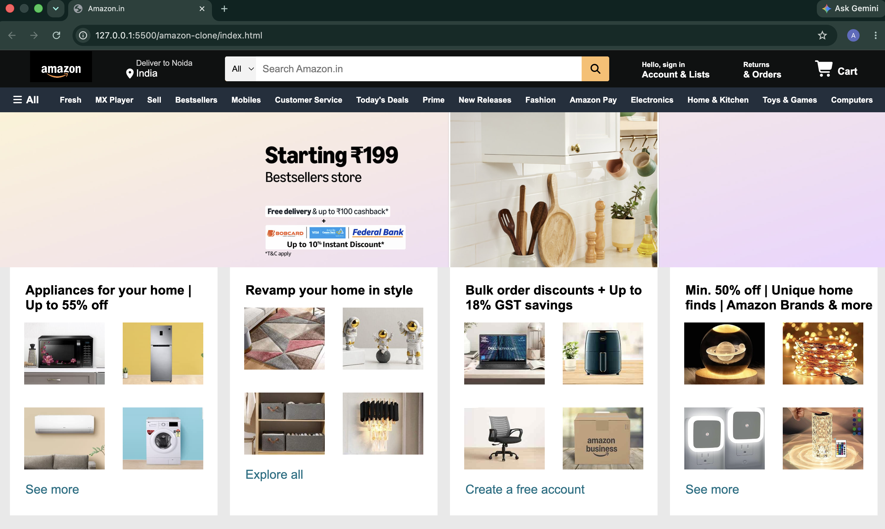

# Amazon Clone

A front-end clone of Amazon India built using HTML and CSS. This project was created to practice web development fundamentals such as page layout, Flexbox, styling, positioning, and project organization.

## Preview



## Features

- Amazon-style navigation bar
- Search bar UI
- Hero section
- Product showcase cards
- Multi-section homepage layout
- Footer section
- Amazon-inspired design

## Technologies Used

- HTML5
- CSS3
- Font Awesome

## Project Structure

```text
amazon-clone/
│
├── images/
├── screenshots/
│   └── amazon-clone-homepage.png
├── index.html
├── style.css
├── .gitignore
└── README.md
```

## What I Learned

- HTML page structure
- CSS styling and selectors
- Flexbox layouts
- Background images
- Positioning elements
- Organizing project files
- Git and GitHub basics

## How to Run

1. Clone the repository.
2. Open `index.html` in your browser.

## Future Improvements

- Make the website fully responsive
- Add JavaScript functionality
- Improve animations and interactions
- Add more Amazon homepage sections

## Author

**Arpit Kumar Singh**